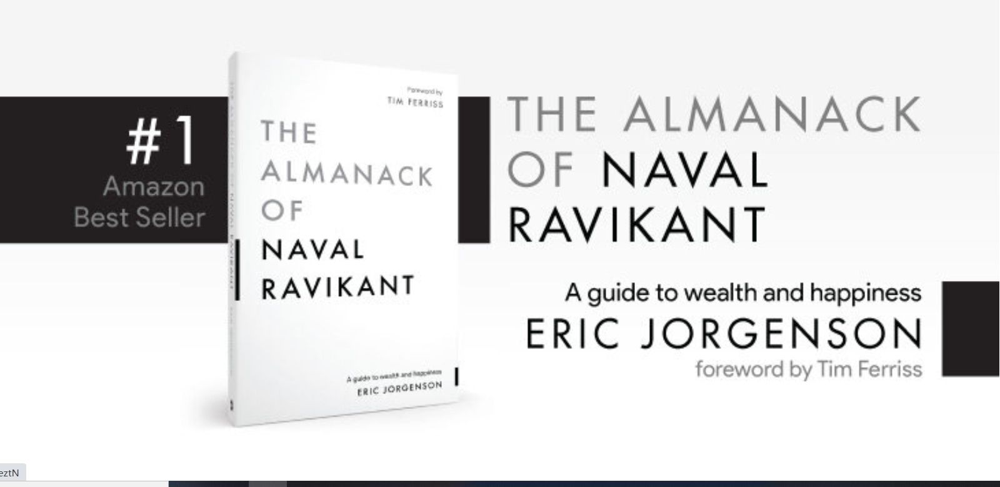
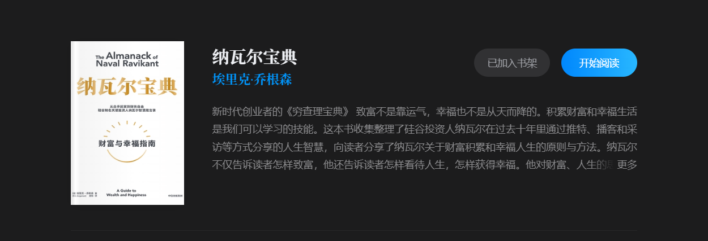
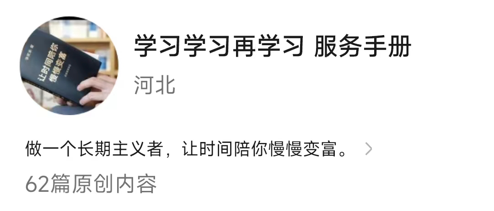
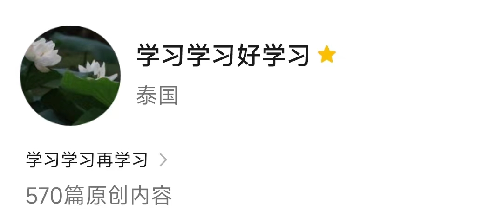
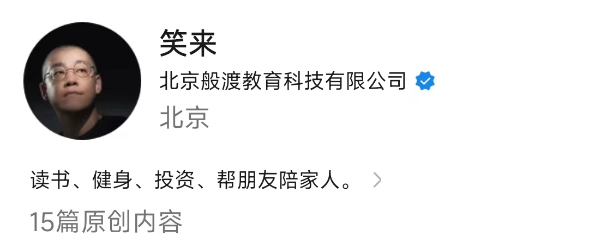

# 《我有一个高质量的“朋友圈”》
> **注**：网站专属文章。

初学者容易过早质疑。
用初选者的不成熟的认知，去判断信息，很可笑。保持开放。
一个从未到过山顶的人，听一个人讲山顶的景色有多么迷人，一定是怀疑的。

读了李笑来、纳瓦尔文章书籍很长后，我自己决定。
无脑相信他们两个都言语，甘愿成为。

李笑来和纳瓦尔早就财富自由了，没必要骗我兜里的几块钱。它们的文章和书籍全部都是免费公开的。
二，他们是有结果的人。
三，李笑来说自己只讲自己做到的事情。
四，他们都是长期主义者，进行价值投资的人。他们对智慧的定义是知道行为的长期后果，一定不会做“短期交易”即骗人卷钱的事情。
四，我一定程度上相信自己的“断物识人”的能力。

# 纳瓦尔

## 01. 纳瓦尔的书籍。

建议阅读纸质版后，再来一次电子版的，有更多的超链接可以跳转。有推特和博客推荐的。
[《纳瓦尔宝典》](https://www.navalmanack.com/) ---- `https://www.navalmanack.com/`。

中信出版社有翻译这本书，微信读书上可以查看。

推特风暴的原链接在这里。翻译版在书籍里面。他的有人。
即刻上有人搬运博客。

### 《纳瓦尔宝典》
我们出生就是狩猎-采集文明的“操作系统”，

你要用钱去节省时间和精力，但前提是你用这些时间和精力去投资自己——学习、健身、思考等。

科学上网，不能的。当我看到更新了。我会上传且赋予自己的解释，如果能。

快速学习能力。
终身学习。
学习第一性原理，新技术不能用类比，需要第一性原理。这就是厨子和厨师类比。

学的越多，类比越多。
 
严以律己，宽以待人。
反之，则人人如身处地狱。

## 03.  纳瓦尔的资料。
* 推特
* 网站
* 纳瓦尔访谈。https://nav.al/
## 02. 纳瓦尔推荐的书籍。
纳瓦尔附录和推荐的账号都要关注和查看。

### 纳瓦尔金句。
以下内容，我建议你打印下来。认真思考几百遍。
* 所谓的智慧就是能够知道事情的长期结果。
* 

纳瓦尔在社交账号以及书中介绍了很好的一些账号和书籍，然后又可以找到一些优质的作者，扩大的优质“朋友圈”，很像套娃是吧。

#  李笑来
李笑来github一定要看，

里面仓库文件下的每一个文件都要看。
看看不同的版本。有跳转的链接，一定去看。
李笑来GitHub账号是一个，除了制定的开源书仓库外，还有`47`多个仓库，有很多很好的仓库，比如[个人电脑使用（以苹果产品为例）](https://github.com/xiaolai/apple-computer-literacy)、[区块链小白书](https://github.com/xiaolai/blockchainlittlebook.com)、[《李笑来的幻灯课》](https://github.com/xiaolai/slidology-from-xiaolai)
、
**注**：可能需要VPN，请自行解决。
## 01. 李笑来的书籍。
里面有各种版本的，我喜欢对比着看，这会刺激我思考，思考去创作方法。
《把时间当做朋友》[PDF下载地址](http://www.lixiaolai.com/time-friend.zip)——`http://www.lixiaolai.com/time-friend.zip` —— 2010年5月30日，我用周筠老师提供的本书第三次印刷清样制作了PDF版本。

* [关于《把时间当作朋友》电子版-博客](http://www.lixiaolai.com/index.php/archives/9456.html)

## 03.  李笑来的资料。
微博
### 公众号
（新生公号）

（学习学习好学习）

（笑来）

公众号往期文章
得到课程

李笑来的博客[新浪博客](http://blog.sina.com.cn/s/articlelist_1576218000_0_1.html)

* 李笑来网站。2008年5月18日，我的博客数据库意外损坏——三年来近700多篇文章2万多条留言烟消云散。霍炬同学折腾了一下午也没有什么结果——后来告诉我，他心中颇为愧疚。这算是坏事，却也算是好事。700多篇文章，一直就没时间去重新整理，且骨子里懒惰一再在这事儿上被纵容；现在数据库坏了，倒也没有什么理由再懒下去了，就正好把之前的书稿重新整理一下，直接发布在网上罢了。
* [李笑来以前备份网站](http://www.lixiaolai.com/index.php/archives/464.html)`http://www.lixiaolai.com/index.php/archives/464.html` 。

所有文章都是可以读到的。[文章归档合集](http://www.lixiaolai.com/index.php/archives) —— 文章按月归档，总计2,834篇文章。

然后你可以点开超链接，随便去读。李笑来有一个写作原则，看是否十年后依然有用。因此，这些文章可能过去很久，但依然有用。我在平时累的时候，就会读李笑来的文章，这就是我能量的来源和休息方式。李笑来公众号，这几个链接在一直处于打开状态。有时候很麻烦，我就做了这个页面，同时也分享给大家。

* 李笑来对外演讲。
## 02. 李笑来推荐的书籍。
《超越感觉》《沟通的方法》

### 《财富自由之路》
这是一本被“标题”所耽误的书籍，标题从里到外都透露着一个字——俗，俗不可耐。
我们的家庭教育还是学校教育，都让我们觉得谈钱就是俗。
他们都喜欢它，但不敢大声说出来我喜欢它，更不敢明面追求它。
因此，很多人不敢买，买了也是偷偷看。

看的都明白，李笑来书里每一个“钱”的字样，一个也没有。
实践的都明白，李笑来处处在说赚钱。只是李笑来就像一个害羞的男孩，不敢直接说，我喜欢你，而是说我们好像在那里见过。

李笑来讲了赚钱的底层原理。比如注意力＞时间＞金钱。
你的价值（估值）等于被别人需要的程度.。

### 《》

## 李笑来金句。
以下内容，我建议你打印下来。认真思考几百遍。
* 所谓聪明。
* 挑最被需要的事情做。
* “像作者一样读书，像读者一样写书。”

英雄所见略同，重新定义。
李笑来说：“对自己的定义将决定一个人对自己的要求，而对自己的要求将决定一个人行动的质量。”

比如努力：「 努力 」的概念，就是关键必要的部分、短期大量、足量的练习
运气。
专长：
聪明：

## 我是如何应对信息流的。
其实呢，除了李笑来和纳瓦尔外，我还在微信公众号、推特、YouTube上关注了好多“人”。比如姜胡说。
比如瑞·达利欧的微信公众号。推特等。强烈建议看看这个[《经济机器是怎样运行的》](http://mp.weixin.qq.com/mp/video?__biz=MzI1MzM3ODczNg==&mid=100000631&sn=cce409474cb39213f51b72a7655dfe93&vid=wxv_1319210002330124288&idx=1&vidsn=8802753c3e29b09f5bc71be7a1ca1691&fromid=1&scene=18&xtrack=1&sessionid=1697806816&subscene=126&ascene=7&realreporttime=1697806910703&clicktime=1697806909&enterid=1697806909&forceh5=1)  还有其他的动画视频。书籍等。

再比如，我读到一本好书，我就会关注相关的账号。纳瓦尔就是如此。
塔勒布。
理查特道金斯《自私的基因》作者。
《黑客与画家》的作者网站和推特。

Wait But Why-Tim Urban的[推特](https://twitter.com/waitbutwhy?t=RsI1dgs5bXaqIQFuxgGOoA&s=09)。官方网站。[微信公众号Wait But Why)

你们当然，以后会明白，我为了看这些账号，重新学习了英语。

首先我尽量让自己接触好的信息流。我就关注一些好书籍

错失良机恐惧症
错失良机恐惧症”指的是对错过信息或机会的恐惧和担忧。正是这种受折磨般的心情，导致人们不由自主地不断刷新推特、脸书、Instagram、WhatsApp[21和各种新闻App。手机一震，推送通知来了，人们就连忙拿起来查看——这样的事情一天能重复几十次。有这种习惯的人可不在少数，这是因为他们在想：“万一是极其重要的大事呢（但从来就没遇上过大事）？”
这种焦虑不仅仅局限在社交媒体上，它已经逐渐渗透到了工作里。就好像电子邮件还不够让人焦虑似的，现在已经有了新一代的即时聊天工具来推波助澜——又是一个整天不间断地侵占你注意力的东西，因为你生怕错过一丁点儿消息或机会。
一边儿去吧。错过了有什么大不了的！在绝大多数时间里，绝大多数人就是会错过绝大多数事情啊。在Basecamp，我们倡导人们坦然面对它。别再担忧错失机缘了，淡定些!
有了淡定的心态，你就会关掉源源不断的信息流，关掉聊天工具，把各种干扰拒之门外，安安心心地把你该做的事做好。有了淡定的心态，你就会从容地通过次日一
